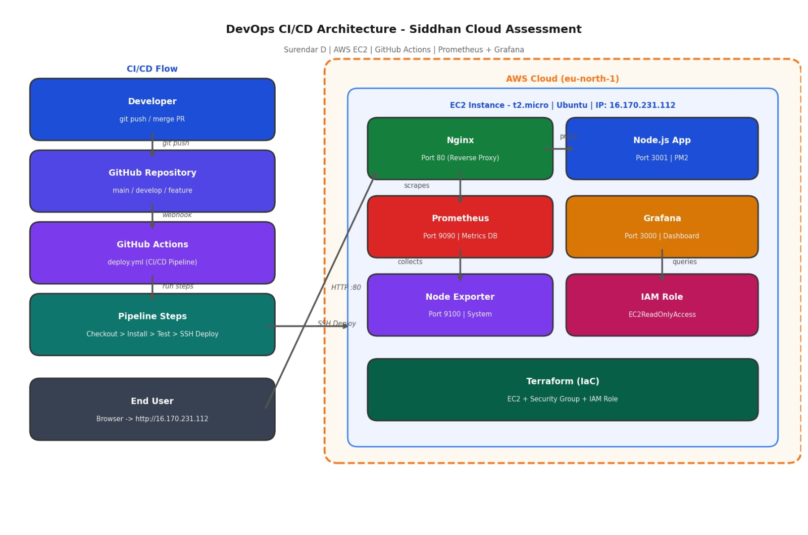

# siddhan-cloud-assessment
Cloud Engineer Assessment - Node.js app deployed on AWS EC2 with CI/CD and Monitoring

# Siddhan Cloud Assessment

## Overview
Node.js DevOps Dashboard deployed on AWS EC2 
with automated CI/CD using GitHub Actions.

## Live Application
- Dashboard: http://16.170.231.112
- Health Check: http://16.170.231.112/health
- Metrics: http://16.170.231.112/metrics
- Prometheus: http://16.170.231.112:9090
- Grafana: http://16.170.231.112:3000

## Architecture


## Tech Stack
- **App**: Node.js + Express
- **Cloud**: AWS EC2 (t2.micro, Ubuntu)
- **CI/CD**: GitHub Actions
- **IaC**: Terraform
- **Monitoring**: Prometheus + Grafana + Node Exporter
- **Reverse Proxy**: Nginx
- **Process Manager**: PM2

## CI/CD Pipeline
1. Developer pushes code to GitHub
2. GitHub Actions triggers automatically
3. Code tested (health check)
4. SSH deploy to AWS EC2
5. PM2 restarts the application

## IAM Configuration
EC2 instance has IAM role with 
AmazonEC2ReadOnlyAccess policy attached.
Configured via Terraform.

## Setup Instructions

### Local Development
```bash
cd app
npm install
node src/app.js
# Visit http://localhost:3001
```

### Deploy with Terraform
```bash
cd terraform
terraform init
terraform plan
terraform apply
```

## Design Decisions
- **Nginx reverse proxy** — Port 80 → 3001, 
  app not directly exposed (security)
- **PM2** — Auto-restart if app crashes
- **GitHub Secrets** — No credentials in code
- **Branch protection** — PR review required
- **Prometheus /metrics** — App-level monitoring

## Trade-offs
- Single EC2 (no HA) — Acceptable for assessment
- t3.micro — Free tier, limited for production
- No HTTPS — Would add SSL in production

## Cost Awareness
- EC2 t3.micro: Free tier eligible
- EBS 20GB: ~$2/month
- Estimated total: ~$2-5/month

## Git Workflow
feature/app-setup → develop → main
- Branch protection on main
- PR required before merge to main
- GitHub Actions on every push to main
